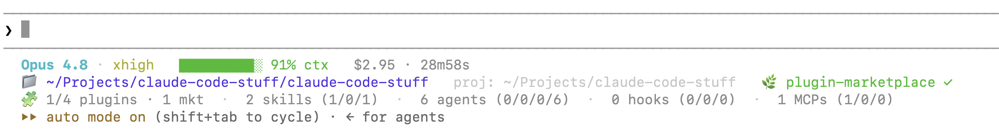

# claude-code-stuff

Justin Pearson's personal Claude Code [plugin marketplace](https://code.claude.com/docs/en/plugin-marketplaces),
plus assorted prompts, skills, and docs for working with Claude Code.

## Install + use

Add the marketplace, then install a plugin from it:

```
/plugin marketplace add justinpearson/claude-code-stuff
/plugin install claude-code-setup@claude-code-stuff
```

The marketplace catalog lives in
[`.claude-plugin/marketplace.json`](.claude-plugin/marketplace.json).

## Plugins

### `claude-code-setup`

Recommended Claude Code configuration. It bundles two skills (see
[`plugins/claude-code-setup`](plugins/claude-code-setup)):

- **`statusline-setup`** — installs a nice multi-line Claude Code status line:

  

- **`learn-skills-and-mcp`** — brief description of MCP servers + skills in
  Claude Code, how they differ, and how to combine them.

After installing, invoke a skill by its namespaced name, for example
`/claude-code-setup:statusline-setup`.

## Other contents

- [`tools/`](tools/) — standalone scripts that are not (yet) packaged as plugins.

